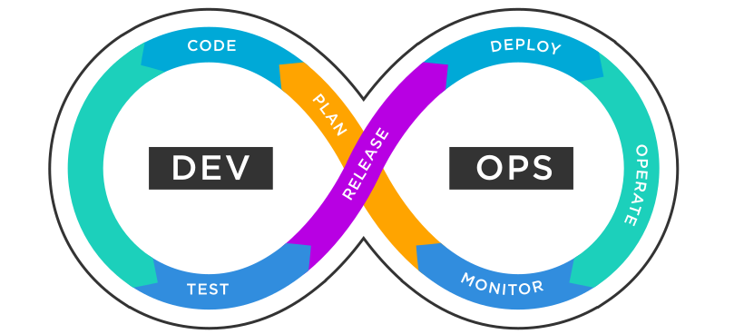

<a name="readme-top"></a>


<!-- PROJECT LOGO -->
<br />
<div align="center">
  <a href="https://github.com/eevlogiev/flask-app">
    
  </a>

<h3 align="center">Flask App Project</h3>

  <p align="center">
    project_description
    <br />
    <a href="https://github.com/eevlogiev/flask-app"><strong>Explore the docs »</strong></a>
    <br />
    <br />
    <a href="https://github.com/eevlogiev/flask-app">View Demo</a>
    ·
    <a href="https://github.com/eevlogiev/flask-app/issues">Report Bug</a>
    ·
    <a href="https://github.com/eevlogiev/flask-app/issues">Request Feature</a>
  </p>
</div>


<!-- TABLE OF CONTENTS -->
<details>
  <summary>Table of Contents</summary>
  <ol>
    <li>
      <a href="#about-the-project">About The Project</a>
      <ul>
        <li><a href="#built-with">Built With</a></li>
      </ul>
    </li>
    <li>
      <a href="#getting-started">Getting Started</a>
      <ul>
        <li><a href="#prerequisites">Prerequisites</a></li>
        <li><a href="#installation">Installation</a></li>
      </ul>
    </li>
    <li><a href="#usage">Usage</a></li>
    <li><a href="#contact">Contact</a></li>
    <li><a href="#acknowledgments">Acknowledgments</a></li>
  </ol>
</details>


<!-- ABOUT THE PROJECT -->
## About The Project

[![Product Name Screen Shot][product-screenshot]](https://example.com)

This project builds a Kubernetes cluster in AWS via Terraform. It also creates a Jenkins server where via pipeline Flask application is being deployed. Deployment creates flask application running on NGINX server on Kubernetes pod. Deployment can also add SSL certificate and dynamically crete DNS entries in Route53 for specific domain.

<p align="right">(<a href="#readme-top">back to top</a>)</p>


### Built With

* [![AWS][AWS]][AWS-url]
* [![Terraform][Terraform]][Terraform-url]
* [![Kubernetes][Kubernetes]][Kubernetes-url]
* [![Helm][Helm]][Helm-url]
* [![Jenkins][Jenkins]][Jenkins-url]
* [![Python][Python]][Python-url]

<p align="right">(<a href="#readme-top">back to top</a>)</p>


<!-- GETTING STARTED -->
## Getting Started

This is an example of how you may give instructions on setting up your project locally.
To get a local copy up and running follow these simple example steps.

### Prerequisites

This is an example of how to list things you need to use the software and how to install them.
* npm
  ```sh
  npm install npm@latest -g
  ```

### Installation

1. Get a free API Key at [https://example.com](https://example.com)
2. Clone the repo
   ```sh
   git clone https://github.com/github_username/repo_name.git
   ```
3. Install NPM packages
   ```sh
   npm install
   ```
4. Enter your API in `config.js`
   ```js
   const API_KEY = 'ENTER YOUR API';
   ```

<p align="right">(<a href="#readme-top">back to top</a>)</p>


<!-- USAGE EXAMPLES -->
## Usage

Use this space to show useful examples of how a project can be used. Additional screenshots, code examples and demos work well in this space. You may also link to more resources.

_For more examples, please refer to the [Documentation](https://example.com)_

<p align="right">(<a href="#readme-top">back to top</a>)</p>


<!-- CONTACT -->
## Contact

Evelin Evlogiev - [![LinkedIn][linkedin-shield]][linkedin-url]

Project Link: [https://github.com/eevlogiev/flask-app](https://github.com/eevlogiev/flask-app)

<p align="right">(<a href="#readme-top">back to top</a>)</p>


<!-- ACKNOWLEDGMENTS -->
## Acknowledgments

* [Nik Vaklinov](https://github.com/nvaklinov/nvaklinov)


<p align="right">(<a href="#readme-top">back to top</a>)</p>


<!-- MARKDOWN LINKS & IMAGES -->
<!-- https://www.markdownguide.org/basic-syntax/#reference-style-links -->

[linkedin-shield]: https://img.shields.io/badge/-LinkedIn-black.svg?style=for-the-badge&logo=linkedin&colorB=555
[linkedin-url]: https://www.linkedin.com/in/e-evlogiev/
[product-screenshot]: images/screenshot.png
[AWS]: https://img.shields.io/badge/aws-%23232F3E?style=for-the-badge&logo=aws
[AWS-url]: https://aws.amazon.com/
[Terraform]: https://img.shields.io/badge/terraform-%237B42BC?style=for-the-badge&logo=terraform
[Terraform-url]: https://www.terraform.io/
[Kubernetes]: https://img.shields.io/badge/kubernetes-%2359666C?style=for-the-badge&logo=kubernetes
[Kubernetes-url]: https://kubernetes.io/
[Helm]: https://img.shields.io/badge/helm-%230F1689?style=for-the-badge&logo=helm
[Helm-url]: https://helm.sh/
[Jenkins]: https://img.shields.io/badge/jenkins-%234A4A55?style=for-the-badge&logo=jenkins
[Jenkins-url]: https://www.jenkins.io/
[Python]: https://img.shields.io/badge/python-%23?style=for-the-badge&logo=python&logoColor=%233776AB&color=%23230F1689
[Python-url]: https://www.python.org/

